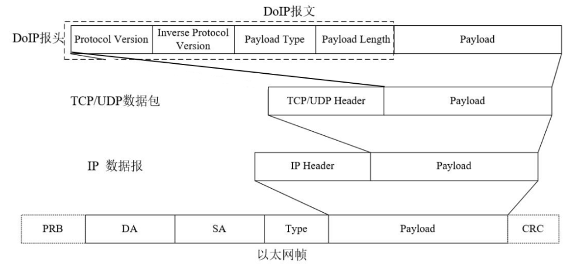
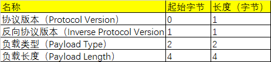
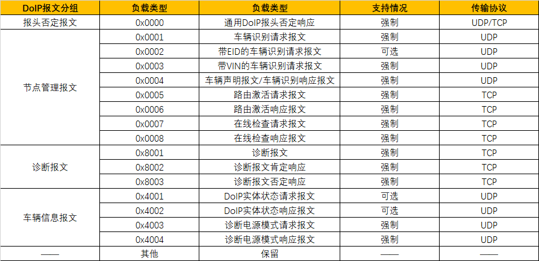
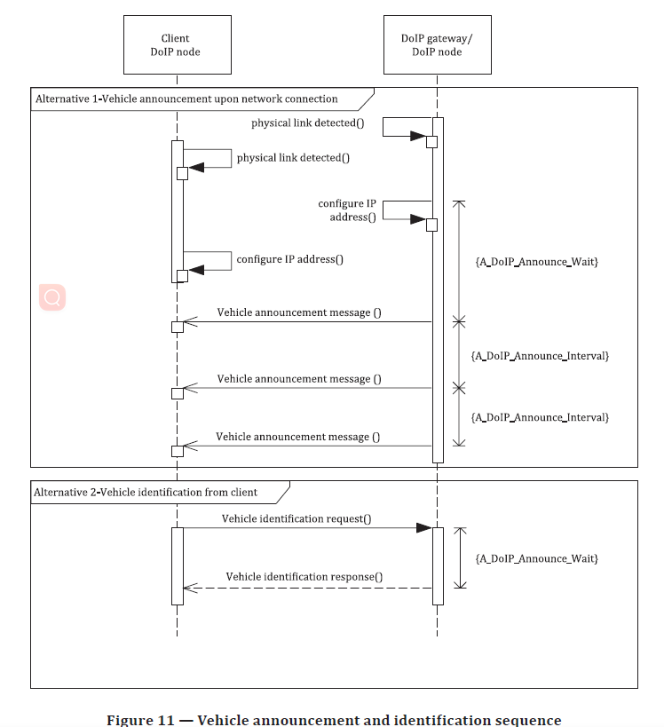

# DoIP

## 综述

用于汽车诊断通信的协议，允许通过 IP 网络进行诊断操作，是一个应用层的协议。

DoIP 协议定义了如何建立和维护诊断会话、如何发送和接收诊断消息、如何处理错误等。它使用特定的消息格式和通信规则来确保数据的正确传输和解析。DoIP 不参与数据的具体诊断逻辑，而是提供一个可靠的传输层，允许诊断工具（Tester）与车辆电子控制单元（ECU）进行通信。具体诊断使用 UDS（Unified Diagnostic Services）协议。

## 报文格式

负载类型包围内容

## 各种报文

### 错误处理报文

报文流程场景示意：

1. Tester 发送一帧 DoIP 报文；
2. ECU（或 DoIP 实体）接收后解析，发现：
   - 报文长度超出规范；
   - 未知的 Payload Type；
   - 不符合 ISO 13400 的报文格式；
   - 内存不足或校验失败；
3. ECU 回复一帧：
   - Payload Type = 0x0000（表示通用否定响应）；
   - Payload Data = 1 字节错误码（具体错误原因，如 0x01 表示格式错误）；
4. Tester 收到错误响应，可以做出适配、重试或诊断。

### 车辆声明报文

主动告诉网络上的诊断设备（Tester）：“我这辆车已经上线啦，并且支持诊断！”，告诉 Tester 有哪些 ECU 支持诊断，以及它们的逻辑地址

client 可以理解为一个 Tester

车辆识别响应报文内容包含 VIN、逻辑地址、EID、GID 等信息

| 字段         | 含义                                        |
| ------------ | ------------------------------------------- |
| VIN          | 车辆识别码（Vehicle Identification Number） |
| 逻辑地址列表 | 支持诊断的 ECU 地址                         |
| 功能状态     | 比如是否处于诊断会话、是否支持 DoIP         |
| 网关属性     | 是否为网关 ECU、是否为 T-Box                |
| 其他可选字段 | 可能包括供应商 ID、车辆类型等               |

车辆的 DoIP 网关会在以下情况主动发送 Vehicle Announcement 报文：

| 场景                       | 描述                                              |
| -------------------------- | ------------------------------------------------- |
| 车辆上电/唤醒后            | 通知网络诊断设备自己上线                          |
| IP 地址获取成功            | 比如 DHCP 分配完成                                |
| VIN 等关键信息变更         | 通知诊断设备更新记录                              |
| 收到 Tester 的车辆发现请求 | Tester 广播 Vehicle Identification Request 后回应 |

### 路由激活报文

让 DoIP 网关知道：我要对哪一个 ECU 进行诊断，请你路由数据过去。

ISO 13400 规定，当测试设备需要通过车载 DoIP 网关将报文路由到车辆内部网络之前，需要执行路由激活阶段，用于激活 TCP_DATA Socket 上的路由。

**为什么需要路由激活？**

- Tester 不直接连接到每个 ECU；
- ECU 有自己私有的逻辑地址；
- ECU 可能在 CAN/LIN 总线上，不具备 IP 地址；
- 所以 Tester 必须先请求网关帮忙 “激活”目标 ECU 路由，才能正常通信。

即使是支持 IP 的设备，在 DoIP 通信之前也仍然需要执行“路由激活（Routing Activation）”。

**路由激活流程**

1. Tester → 网关：Routing Activation Request 报文包含：

- 请求激活的 ECU 逻辑地址（比如 0x0E00）
- Client ID（Tester 的身份）
- Activation Type（激活类型）
- Option Record（附加信息，比如安全等级）

2. 网关验证是否合法、是否支持该 ECU

- 检查权限、负载、是否已激活

3. 网关 → Tester：Routing Activation Response 报文成功时返回：

- 正常激活码
- Assigned Address（分配的会话地址）
- Routing Activation State（成功/失败/拒绝等）

4. 激活后，Tester 可以发送 UDS 报文给该 ECU

总结下就是：
Routing Activation 是 Tester 与 DoIP 网关协商的一步，用来“激活”网关对某个目标 ECU 的转发路由。目标 ECU 本身可能不支持 IP/TCP/DoIP，只通过 CAN 等总线接入，网关则负责协议转换与转发。

### 在线检测请求报文

确认某个 DoIP 节点（通常是 Tester 或网关）是否仍在线并保持活跃状态。30s 左右发送一次请求

**通信流程**

| 发送方        | 接收方        | 报文类型                          | 目的               |
| ------------- | ------------- | --------------------------------- | ------------------ |
| Tester        | DoIP 网关/ECU | **Alive Check Request (0x4003)**  | 我还在线，别断连接 |
| DoIP 网关/ECU | Tester        | **Alive Check Response (0x4004)** | 我也还在，连接继续 |

**其他应用场景**

| 场景                 | 描述                                    |
| -------------------- | --------------------------------------- |
| OTA 升级前状态确认   | Tester 确保 ECU 当前在线且可升级        |
| 长时间诊断保持连接   | Tester 在执行大批量 UDS 操作中维持连接  |
| 云诊断时确认车辆状态 | 云端诊断服务器与 T-Box 建立保持会话状态 |

### 诊断报文

诊断报文是 Tester 与 ECU 间，基于 UDS 协议的请求-响应型通信消息，通常用于车辆维修、调试、远程运维等。

**请求报文结构（Tester → ECU）**

| 字段                   | 含义                       | 示例                                 |
| ---------------------- | -------------------------- | ------------------------------------ |
| **Service ID (SID)**   | 1 字节，表示诊断服务类型   | `0x22`：读数据；`0x10`：诊断会话控制 |
| **Subfunction / 参数** | 可选，依据服务类型不同     | 数据 ID、会话类型、安全等级等        |
| **数据内容**           | 可选，具体数据或请求结构体 | 例：`0xF190` 表示读取 VIN 的数据 ID  |

**响应报文结构（ECU → Tester）**

| 字段                      | 含义                               | 示例                               |
| ------------------------- | ---------------------------------- | ---------------------------------- |
| **Positive Response SID** | 成功响应时为 `请求SID + 0x40`      | 请求为 `0x22`，响应为 `0x62`       |
| **响应参数**              | 对应请求的回应数据                 | VIN 编号、DTC 信息等               |
| **或 Negative Response**  | 失败时 SID 固定为 `0x7F`，附错误码 | 如 `0x7F 0x22 0x13` 表示条件不正确 |

### 实体状态请求报文

DoIP 实体状态请求报文是 Tester 向网关或设备发送的“状态查询命令”，用于获取对方当前的运行状态、支持能力、会话信息等。实际上类似于 ping。**不需要进行路由激活！！**

tester 到 ecu 的报文没有 payload，只是测试目标的协议支持情况

| 字段                       | 长度   | 描述                                          |
| -------------------------- | ------ | --------------------------------------------- |
| Node Type                  | 1 byte | 设备类型，例如网关/诊断设备                   |
| Maximum TCP Connections    | 1 byte | 支持的最大 TCP 会话数                         |
| Current TCP Connections    | 1 byte | 当前已建立的连接数                            |
| Supported Activation Types | 1 byte | 位掩码形式表示支持的路由激活类型              |
| **Further Info**           | 可变   | 包括支持的 ECU 地址、状态列表等（取决于实现） |

**实际应用场景**

| 场景                           | 用途                               |
| ------------------------------ | ---------------------------------- |
| Tester 扫描网络设备状态        | 检测是否有可连接的设备             |
| 测试工具自适应诊断功能         | 根据网关返回状态动态生成测试用例   |
| ECU 测试流程前检查             | 在批量测试生产线用                 |
| OTA 管理系统判断是否可升级设备 | 远程管理系统通过该报文筛选目标设备 |

### 诊断电源模式

诊断电源模式表示车辆当前的电源状态，是通过 DoIP 报文（如实体状态响应）或 UDS 诊断服务中返回的字段，用于辅助判断 ECU 是否处于可诊断状态。

**可用状态**

| 电源模式值（Power Mode） | 状态名称                     | 含义                           |
| ------------------------ | ---------------------------- | ------------------------------ |
| `0x00`                   | 不明（Unknown）              | 无法确定当前状态               |
| `0x01`                   | 关闭（Vehicle Power Off）    | 主电源关闭，车辆下电状态       |
| `0x02`                   | 关键开（Key in）             | 钥匙插入但未点火               |
| `0x03`                   | 关键运行（Key On）           | 点火开启，车辆处于正常通电状态 |
| `0x04`                   | 发动机运行（Engine Running） | 发动机正在运行                 |
| `0x05`                   | 关键辅助（Accessory On）     | 仅开启辅助电源（如音响）       |
| `0x06` \~ `0x0F`         | 保留                         | 暂未定义使用                   |

## TCP 层如何处理 DoIP 报文的顺序

1. 三次握手（TCP 连接建立）。Tester（客户端）主动连接 DoIP 网关的 TCP 端口（通常是 13400）；网关作为 TCP 服务端，接受连接；三次握手完成后，建立一条 TCP 连接通道。
2. 发送 Routing Activation 报文。Tester 向 DoIP 网关发送 Routing Activation Request（Payload Type: 0x0005）；网关收到后会验证逻辑地址、权限、安全状态等；若成功，回复 Routing Activation Response（0x0006）；一旦激活成功，才能开始正式的诊断通信（如发送 UDS 报文）。
3. 发送诊断报文（UDS over DoIP）。一旦路由激活完成，就可以开始发送 UDS 报文，例如：
   Read DTC（读故障码）
   Clear DTC（清故障码）
   Routine Control（执行诊断例程）
   UDS 报文被封装在 DoIP 的 Diagnostic Message 中（Payload Type: 0x8001）
4. 发送 Alive Check 请求。若诊断过程时间较长或一段时间无数据传输，Tester 会主动发送：Alive Check Request（0x4003），等待 Alive Check Response（0x4004）。目的是保持 TCP 会话、维持路由激活状态、防止网关超时释放资源。
5. 四次挥手（TCP 连接关闭）。当诊断完成或 Tester 主动断开连接时：执行 TCP 的四次挥手过程；网关清理会话状态，释放资源，撤销路由激活。

## UDS
