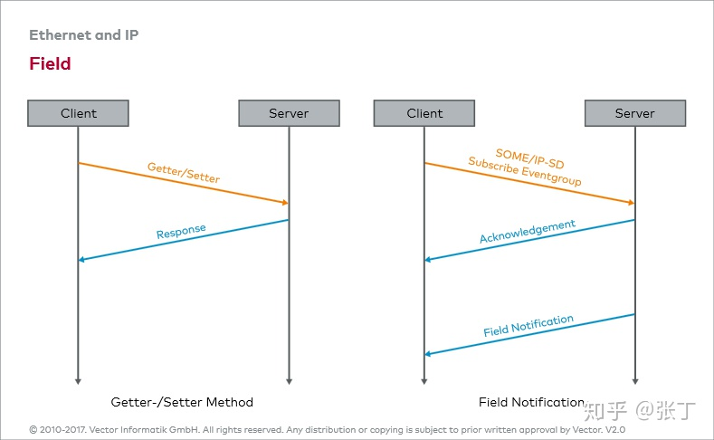
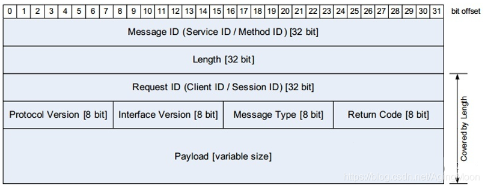
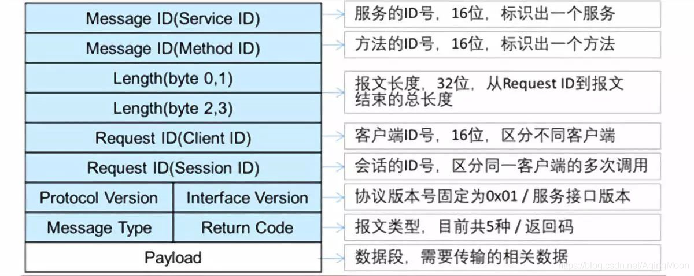

# SOME/IP

SOME/IP 其实是构架在 TCP/UDP 之上的应用层通信协议，它的内容虽然很多很杂，但本质上也就是定义了 SOME/IP 包头和数据的内容而已。SOME/IP 是在接收方有需求的时候才发送，这种方法的优点在于总线上不会出现过多不必要的数据，从而降低负载。

## SOME/IP 服务

服务是 SOME/IP 的核心，服务端提供服务，客户端使用服务。服务由零个或多个方法、事件以及字段组成。

### 方法 Method

客户端调用服务端的函数/程序/服务/方法。方法有两种形式：

- Request & Response：常规的客户端请求，服务端响应
- Fire & Forget（Request_NoReturn）：单向客服端请求，服务端不响应

### 事件 Event

客户端向服务端订阅事件组 EventGroup，当事件组有更新时，服务端发布消息，通知所有订阅的客户端

### 字段 Field

方法和事件的组合，提供 Getter/Setter 两个方法用于获取/设置字段值，以及一个 Notification 事件，当字段值变化时，服务端发布消息，通知订阅的客户端。



## 消息格式

TCP/UDP 的 Payload 部分，由 SOME/IP Header 和 SOME/IP Payload 组成



## 服务发现 SOME/IP SD

在汽车中，多个服务提供者（ECU）会定期通过广播方式发送 SOME/IP SD 报文中的 Entry（如 OfferService），而其他需要这些服务的客户端（Consumer）监听广播，当发现感兴趣的服务时，会通过 TCP 或 UDP 主动连接到服务端，建立通信。

SD 报文由 sd-header, entry 和 option 组成。类似于 Entry 说：“我有导航服务”，Option 说：“你可以用 TCP 到 192.168.0.5:30500 找我”

SD 报文中 entry 和 option 都是数组，能够同时标明多个服务：

```
{
    Header,
    EntryArray: [ Entry_0, Entry_1, ..., Entry_N ],
    OptionArray: [ Option_0, Option_1, ..., Option_M ]
}
```

### entry(我要提供/查找某个服务)

SOME/IP 的 Entry 是服务发现消息中的“服务注册描述条目”，用来告诉网络中其他节点：我提供了哪些服务、在哪可以找到我、我支持哪些方法、多久发一次广播等信息。

entry 的类型有

| Entry 类型                | 含义说明                                     |
| ------------------------- | -------------------------------------------- |
| `FindService`             | 查询服务：比如 Tester 想知道某个服务是否存在 |
| `OfferService`            | 提供服务：比如 ECU 向网络广播“我有某个服务”  |
| `SubscribeEventGroup`     | 订阅事件组                                   |
| `StopOfferService`        | 停止提供服务                                 |
| `StopSubscribeEventGroup` | 停止订阅                                     |

通过查看 entry，服务提供者或客户端可以了解网络中有哪些服务可用。

### option(连接信息（IP/端口/协议）)

option 与 entry 同时存在，entry 中使用 option 的数组下标表明服务的连接信息，以达到复用的效果。一个 entry 可有多个 option，表示多播服务；一个 option 可被多个 entry 共享，表示多服务共享同一连接。

option 的内容可有：

| 字段          | 值                  |
| ------------- | ------------------- |
| Service ID    | 0x1234              |
| Instance ID   | 0x0001              |
| Major Version | 1                   |
| TTL           | 5（秒）             |
| Option Index  | 0（指向 Option[0]） |
