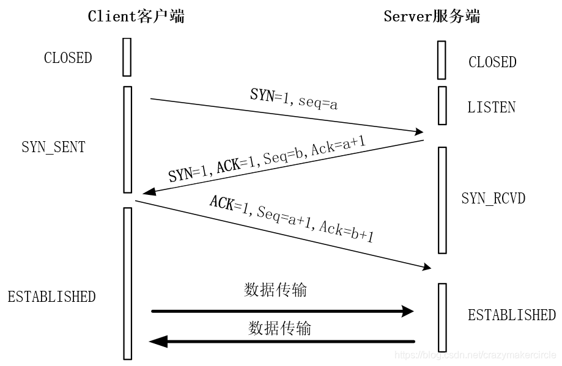
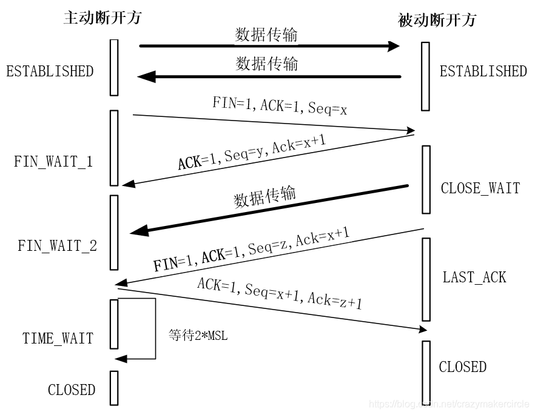
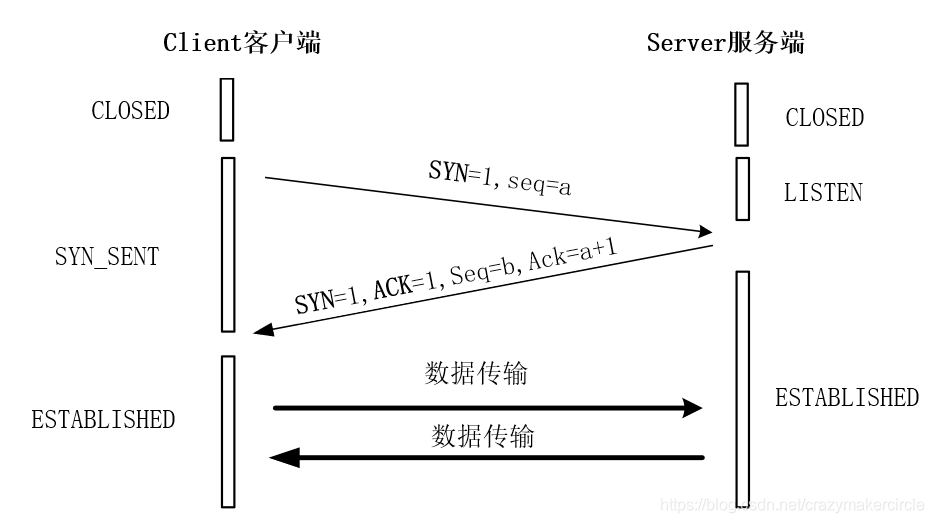

# TCP/IP 的分层模型

## 应用层

HTTP、FTP、SMTP（电子邮件）、SSH、DNS

## 传输层

TCP 协议是一个面向连接的、可靠的传输协议，它提供一种可靠的字节流，能保证数据完整、无损并且按顺序到达。TCP 尽量连续不断地测试网络的负载并且控制发送数据的速度以避免网络过载。另外，TCP 试图将数据按照规定的顺序发送。

UDP 协议是一个无连接的数据报协议，是一个“尽力传递”和“不可靠”协议，不会对数据包是否已经到达目的地进行检查，并且不保证数据包按顺序到达。

总体来说，TCP 协议传输效率低，但可靠性强；UDP 协议传输效率高，但可靠性略低，适用于传输可靠性要求不高、体量小的数据

### 三次握手

### 四次挥手

### 面试题

**问题（1）：为什么关闭连接的需要四次挥手，而建立连接却只要三次握手呢？**
关闭连接时，被动断开方在收到对方的 FIN 结束请求报文时，很可能业务数据没有发送完成，并不能立即关闭连接，被动方只能先回复一个 ACK 响应报文，告诉主动断开方：“你发的 FIN 报文我收到了，只有等到我所有的业务报文都发送完了，我才能真正的结束，在结束之前，我会发你 FIN+ACK 报文的，你先等着”。所以，被动断开方的确认报文，需要拆开成为两步，故总体就需要四步挥手。

而在建立连接场景中，Server 端的应答可以稍微简单一些。当 Server 端收到 Client 端的 SYN 连接请求报文后，其中 ACK 报文表示对请求报文的应答，SYN 报文用来表示服务端的连接也已经同步开启了，而 ACK 报文和 SYN 报文之间，不会有其他报文需要发送，故而可以合二为一，可以直接发送一个 SYN+ACK 报文。所以，在建立连接时，只需要三次握手即可。

**问题（2）：为什么连接建立的时候是三次握手，可以改成两次握手吗？**
三次握手完成两个重要的功能：一是双方都做好发送数据的准备工作，而且双方都知道对方已准备好；二是双方完成初始 SN 序列号的协商，双方的 SN 序列号在握手过程中被发送和确认。

如果把三次握手改成两次握手，可能发生死锁。两次握手的话，缺失了 Client 的二次确认 ACK 帧，假想的 TCP 建立的连接时二次挥手，可以如下图所示：

在假想的 TCP 建立的连接时二次握手过程中，Client 发送 Server 发送一个 SYN 请求帧，Server 收到后发送了确认应答 SYN+ACK 帧。按照两次握手的协定，Server 认为连接已经成功地建立了，可以开始发送数据帧。这个过程中，如果确认应答 SYN+ACK 帧在传输中被丢失，Client 没有收到，Client 将不知道 Server 是否已准备好，也不知道 Server 的 SN 序列号，Client 认为连接还未建立成功，将忽略 Server 发来的任何数据分组，会一直等待 Server 的 SYN+ACK 确认应答帧。而 Server 在发出的数据帧后，一直没有收到对应的 ACK 确认后就会产生超时，重复发送同样的数据帧。这样就形成了死锁。

**问题（3）：为什么主动断开方在 TIME-WAIT 状态必须等待 2MSL 的时间？**
原因之一：主动断开方等待 2MSL 的时间，是为了确保两端都能最终关闭。假设网络是不可靠的，被动断开方发送 FIN+ACK 报文后，其主动方的 ACK 响应报文有可能丢失，这时候的被动断开方处于 LAST-ACK 状态的，由于收不到 ACK 确认被动方一直不能正常的进入 CLOSED 状态。在这种场景下，被动断开方会超时重传 FIN+ACK 断开响应报文，如果主动断开方在 2MSL 时间内，收到这个重传的 FIN+ACK 报文，会重传一次 ACK 报文，后再一次重新启动 2MSL 计时等待，这样，就能确保被动断开方能收到 ACK 报文，从而能确保被动方顺利进入到 CLOSED 状态。只有这样，双方都能够确保关闭。反过来说，如果主动断开方在发送完 ACK 响应报文后，不是进入 TIME_WAIT 状态去等待 2MSL 时间，而是立即释放连接，则将无法收到被动方重传的 FIN+ACK 报文，所以不会再发送一次 ACK 确认报文，此时处于 LAST-ACK 状态的被动断开方，无法正常进入到 CLOSED 状态。

原因之二：防止“旧连接的已失效的数据报文”出现在新连接中。主动断开方在发送完最后一个 ACK 报文后，再经过 2MSL，才能最终关闭和释放端口，这就意味着，相同端口的新 TCP 新连接，需要在 2MSL 的时间之后，才能够正常的建立。2MSL 这段时间内，旧连接所产生的所有数据报文，都已经从网络中消失了，从而，确保了下一个新的连接中不会出现这种旧连接请求报文。

**问题（4）：如果已经建立了连接，但是 Client 端突然出现故障了怎么办？**
TCP 还设有一个保活计时器，Client 端如果出现故障，Server 端不能一直等下去，这样会浪费系统资源。每收到一次 Client 客户端的数据帧后，Server 端都的保活计时器会复位。计时器的超时时间通常是设置为 2 小时，若 2 小时还没有收到 Client 端的任何数据帧，Server 端就会发送一个探测报文段，以后每隔 75 秒钟发送一次。若一连发送 10 个探测报文仍然没反应，Server 端就认为 Client 端出了故障，接着就关闭连接。如果觉得保活计时器的两个多小时的间隔太长，可以自行调整 TCP 连接的保活参数。

## 网络层和数据链路层

电脑视角：

- 首先我要知道我的 IP 以及对方的 IP
- 通过子网掩码判断我们是否在同一个子网
- 在同一个子网就通过 arp 获取对方 mac 地址直接扔出去
- 不在同一个子网就通过 arp 获取默认网关的 mac 地址直接扔出去

交换机视角：

- 我收到的数据包必须有目标 MAC 地址
- 通过 MAC 地址表查映射关系
- 查到了就按照映射关系从我的指定端口发出去
- 查不到就所有端口都发出去

路由器视角：

- 我收到的数据包必须有目标 IP 地址
- 通过路由表查映射关系
- 查到了就按照映射关系从我的指定端口发出去
- 查不到则返回一个路由不可达的数据包

## igmp
